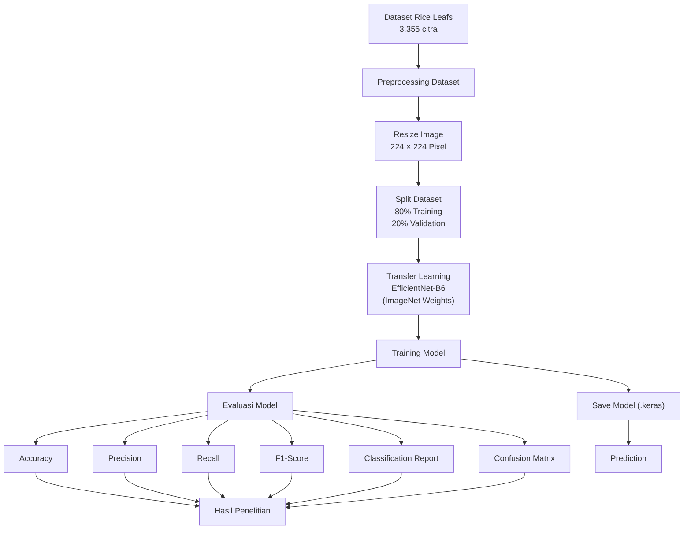
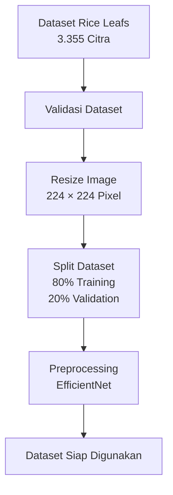
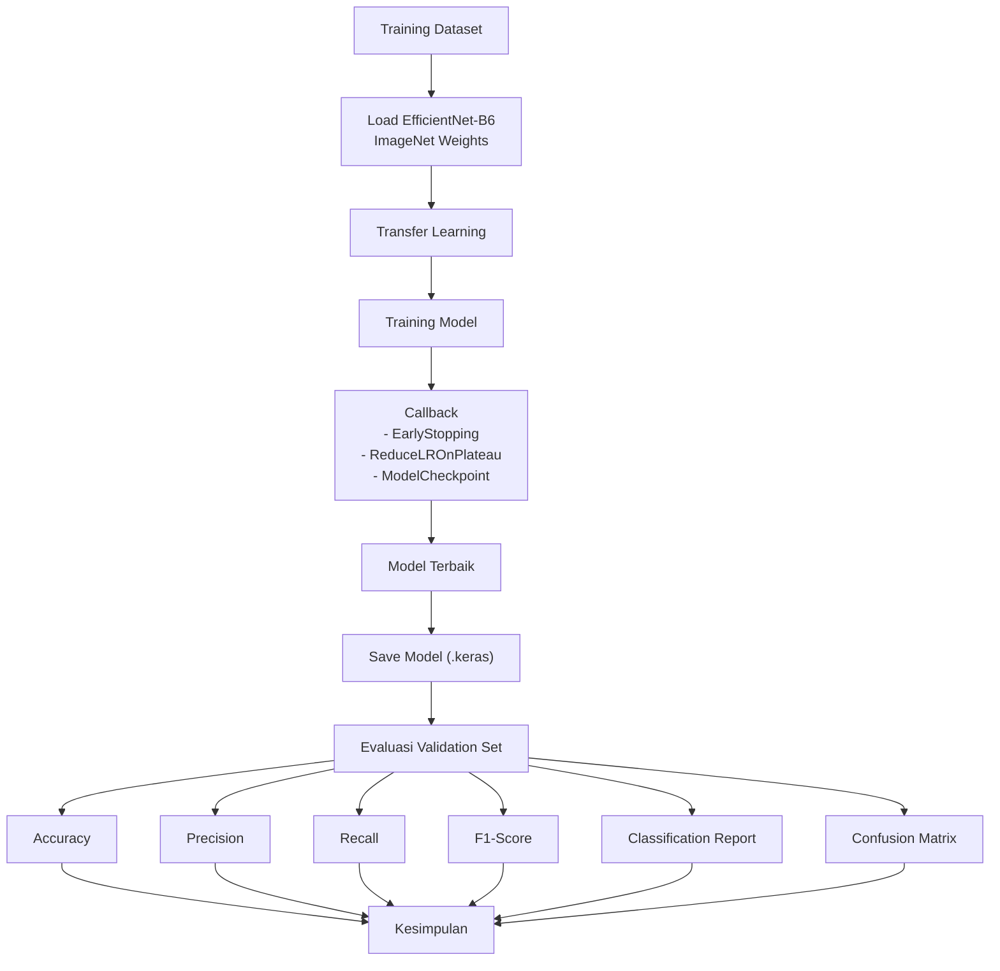
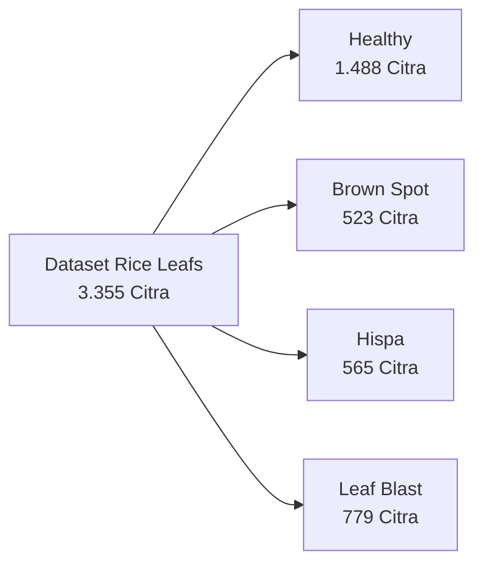

# Arsitektur Sistem dan Landasan Teori

Dokumen ini menjelaskan arsitektur sistem, desain penelitian, variabel penelitian, serta landasan teori yang digunakan sebagai dasar implementasi model EfficientNet-B6 pada penelitian klasifikasi penyakit daun padi.

**Judul Penelitian:** Klasifikasi Penyakit Daun Padi Menggunakan EfficientNet-B6 dengan Pendekatan Transfer Learning

**Peneliti:** Syukron Nur Fadillah | NIM 240202885

**Status:** Selesai (Tahap Perancangan Metodologi, Implementasi Sistem, dan Evaluasi Model)

---

## 1. Arsitektur Komponen Sistem

Penelitian ini merupakan penelitian eksperimen berbasis klasifikasi citra menggunakan model **EfficientNet-B6** dengan pendekatan **Transfer Learning**. Seluruh proses dilakukan secara offline menggunakan dataset **Rice Leafs** pada lingkungan **Google Colab Free**. Dataset diproses melalui tahapan preprocessing, pelatihan model, evaluasi performa, hingga menghasilkan model klasifikasi penyakit daun padi.

---

## 2. Alur Preprocessing Data

Tahap preprocessing dilakukan sebelum proses pelatihan model. Seluruh citra diperiksa, diubah ukurannya menjadi **224 × 224 piksel**, kemudian dibagi menjadi **80% data training** dan **20% data validation**.

---

## 3. Alur Pelatihan dan Evaluasi Model

Model EfficientNet-B6 menggunakan bobot awal dari **ImageNet** kemudian dilakukan **Transfer Learning**. Setelah proses pelatihan selesai, model dievaluasi menggunakan beberapa metrik evaluasi.

---

## 4. Desain Variabel Penelitian

### 4.1 Variabel Independen (Independent Variable)

Variabel independen merupakan model deep learning yang digunakan pada penelitian.

| Variabel | Jenis | Keterangan |
|----------|------|------------|
| EfficientNet-B6 | Independent Variable | Model CNN berbasis Transfer Learning menggunakan bobot ImageNet |

---

### 4.2 Variabel Dependen (Dependent Variable)

Variabel dependen merupakan performa model klasifikasi.

| Variabel | Metrik |
|----------|---------|
| Accuracy | Persentase prediksi benar |
| Precision | Ketepatan prediksi |
| Recall | Kemampuan menemukan kelas sebenarnya |
| F1-Score | Harmonic Mean Precision dan Recall |
| Classification Report | Ringkasan seluruh metrik |
| Confusion Matrix | Distribusi hasil klasifikasi |

---

### 4.3 Variabel Kontrol

| Variabel | Nilai |
|----------|-------|
| Dataset | Rice Leafs |
| Jumlah Kelas | 4 |
| Split Dataset | 80% Training : 20% Validation |
| Ukuran Citra | 224 × 224 Pixel |
| Batch Size | 2 |
| Epoch Maksimum | 25 |
| Optimizer | Adam |

---

## 5. Struktur Dataset

Dataset yang digunakan merupakan **Rice Leafs Dataset** yang terdiri dari empat kelas.

| Kelas | Jumlah Citra |
|--------|-------------|
| Healthy | 1488 |
| BrownSpot | 523 |
| Hispa | 565 |
| LeafBlast | 779 |
| **Total** | **3355** |

---

## 6. Landasan Teori

### 6.1 Artificial Intelligence

Artificial Intelligence (AI) merupakan cabang ilmu komputer yang bertujuan mengembangkan sistem yang mampu meniru kemampuan berpikir manusia untuk menyelesaikan suatu permasalahan secara otomatis. Konsep AI mulai dikenal sejak tahun 1950-an dan terus berkembang hingga saat ini.

Dalam bidang pertanian, AI diterapkan pada berbagai aspek seperti identifikasi hama dan penyakit tanaman, prediksi hasil panen, serta sistem irigasi otomatis. Penelitian ini menggunakan AI sebagai fondasi dasar dalam pengembangan sistem klasifikasi penyakit daun padi.

---

### 6.2 Machine Learning

Machine Learning merupakan bagian dari Artificial Intelligence yang memungkinkan komputer mempelajari pola dari data sehingga mampu melakukan prediksi tanpa diprogram secara eksplisit. Metode ini bekerja dengan membangun model matematis berdasarkan data latih yang diberikan.

Dalam penelitian ini, Machine Learning digunakan untuk membangun model klasifikasi yang mampu membedakan daun padi sehat dan daun yang terinfeksi penyakit berdasarkan citra yang diberikan. Pendekatan yang digunakan termasuk dalam kategori Supervised Learning karena data latih telah memiliki label kelas.

---

### 6.3 Deep Learning

Deep Learning merupakan pengembangan Machine Learning yang menggunakan jaringan saraf tiruan berlapis (Artificial Neural Network) sehingga mampu mempelajari fitur secara otomatis dari data citra. Jaringan ini terdiri dari beberapa lapisan tersembunyi yang memungkinkan model menangkap representasi data secara hierarkis.

Keunggulan Deep Learning dibandingkan metode Machine Learning konvensional adalah kemampuannya dalam mengekstraksi fitur secara otomatis tanpa memerlukan ekstraksi fitur manual. Hal ini sangat berguna dalam klasifikasi citra karena pola penyakit pada daun seringkali sulit didefinisikan secara manual.

---

### 6.4 Convolutional Neural Network (CNN)

CNN merupakan arsitektur Deep Learning yang dirancang khusus untuk pengolahan citra digital melalui proses convolution, pooling, dan fully connected layer. Lapisan convolution berfungsi untuk mendeteksi fitur-fitur penting seperti tepi, tekstur, dan pola pada citra. Lapisan pooling berfungsi untuk mengurangi dimensi data sehingga komputasi menjadi lebih efisien.

Arsitektur CNN telah terbukti sangat efektif dalam berbagai tugas klasifikasi citra, termasuk identifikasi penyakit pada tanaman. Penelitian ini menggunakan EfficientNet-B6 yang merupakan salah satu varian dari arsitektur CNN dengan performa tinggi.

---

### 6.5 EfficientNet-B6

EfficientNet-B6 merupakan salah satu varian EfficientNet yang menggunakan metode **Compound Scaling** sehingga mampu meningkatkan performa klasifikasi citra dengan penggunaan parameter yang lebih efisien dibanding arsitektur CNN konvensional. Metode Compound Scaling mengombinasikan peningkatan kedalaman, lebar, dan resolusi secara bersamaan.

EfficientNet memiliki delapan varian (B0 hingga B7) dengan tingkat kompleksitas yang berbeda. Varian B6 dipilih dalam penelitian ini karena memiliki keseimbangan antara performa tinggi dan kebutuhan komputasi yang masih dapat diakomodasi oleh lingkungan Google Colab Free.

---

### 6.6 Transfer Learning

Transfer Learning merupakan teknik pembelajaran yang memanfaatkan bobot model yang telah dilatih pada dataset ImageNet sehingga proses pelatihan menjadi lebih cepat serta mampu meningkatkan performa klasifikasi pada dataset baru. Teknik ini sangat bermanfaat ketika dataset yang tersedia relatif kecil.

Dalam penelitian ini, EfficientNet-B6 menggunakan bobot pretrained ImageNet. Lapisan konvolusi tetap dipertahankan (feature extraction) dan hanya lapisan fully connected yang dimodifikasi sesuai dengan jumlah kelas pada dataset. Pendekatan ini memungkinkan model untuk memanfaatkan pengetahuan dari dataset besar dan mengadaptasikannya untuk tugas klasifikasi penyakit daun padi.

---

### 6.7 Evaluasi Model

Performa model dievaluasi menggunakan beberapa metrik berikut.

#### Accuracy

Accuracy menunjukkan persentase prediksi yang benar terhadap seluruh data.

$$
Accuracy = \frac{TP + TN}{TP + TN + FP + FN}
$$

---

#### Precision

Precision menunjukkan tingkat ketepatan model dalam melakukan prediksi positif.

$$
Precision = \frac{TP}{TP + FP}
$$

---

#### Recall

Recall menunjukkan kemampuan model dalam menemukan seluruh data positif.

$$
Recall = \frac{TP}{TP + FN}
$$

---

#### F1-Score

F1-Score digunakan untuk mengukur keseimbangan antara Precision dan Recall.

$$
F1 = \frac{2 \times Precision \times Recall}{Precision + Recall}
$$

---

#### Confusion Matrix

Confusion Matrix digunakan untuk melihat jumlah prediksi benar maupun salah pada setiap kelas klasifikasi.

#### Classification Report

Classification Report menyajikan Accuracy, Precision, Recall, dan F1-Score setiap kelas sehingga performa model dapat dianalisis secara lebih rinci.

---

## 7. Keputusan Desain Penelitian

| Aspek | Keputusan | Justifikasi |
|-------|-----------|-------------|
| Dataset | Rice Leafs | Sesuai proposal penelitian |
| Model | EfficientNet-B6 | Menggunakan Transfer Learning |
| Split Data | 80% : 20% | Memisahkan data training dan validation |
| Image Size | 224 × 224 | Menyesuaikan input EfficientNet |
| Batch Size | 2 | Menyesuaikan keterbatasan Google Colab Free |
| Epoch | 25 | Sesuai rancangan penelitian |
| Optimizer | Adam | Stabil untuk proses training |
| EarlyStopping | Digunakan | Mengurangi risiko overfitting |
| ReduceLROnPlateau | Digunakan | Mengurangi learning rate ketika loss stagnan |
| ModelCheckpoint | Digunakan | Menyimpan model terbaik selama training |

---

## 8. Mapping Implementasi Kode

| Komponen | Implementasi |
|----------|--------------|
| Dataset Loader | TensorFlow Dataset |
| Resize Image | tf.image.resize() |
| Split Dataset | 80% Training, 20% Validation |
| Model | EfficientNetB6 |
| Transfer Learning | weights="imagenet" |
| Callback | EarlyStopping, ReduceLROnPlateau, ModelCheckpoint |
| Optimizer | Adam |
| Loss Function | SparseCategoricalCrossentropy |
| Evaluasi | Accuracy, Precision, Recall, F1-Score, Classification Report, Confusion Matrix |
| Visualisasi | Matplotlib |
| Save Model | model.save() |

---

## 9. Referensi

- Milano, A. C., Yasid, A., & Wahyuningrum, R. T. (2024). Klasifikasi Penyakit Daun Padi Menggunakan Model Deep Learning EfficientNet-B6. JITET (Jurnal Informatika dan Teknik Elektro Terapan), Vol.12 No.1.

- Tan, M., & Le, Q. V. (2019). EfficientNet: Rethinking Model Scaling for Convolutional Neural Networks. Proceedings of the 36th International Conference on Machine Learning.

- Goodfellow, I., Bengio, Y., & Courville, A. (2016). Deep Learning. MIT Press.

- TensorFlow Official Documentation. https://www.tensorflow.org/

- Keras API Documentation. https://keras.io/

---

## 10. Navigasi Repository

| Folder | Keterangan |
|--------|------------|
| [00-admin](../00-admin/) | Administrasi Penelitian |
| [01-proposal](../01-proposal/) | Proposal Penelitian |
| [02-literatur](../02-literatur/) | Studi Literatur |
| [04-data](../04-data/) | Dataset Penelitian |
| [05-kode](../05-kode/) | Implementasi Model |
| [06-output](../06-output/) | Hasil Pelatihan |
| [07-manuskrip](../07-manuskrip/) | Manuskrip |
| [08-laporan](../08-laporan/) | Laporan |
| [09-docs](../09-docs/) | Dokumentasi |

---

## Ringkasan

Penelitian ini menggunakan model **EfficientNet-B6** dengan pendekatan **Transfer Learning** untuk melakukan klasifikasi penyakit daun padi menggunakan dataset **Rice Leafs**. Seluruh implementasi dilakukan pada **Google Colab Free** dengan pembagian data **80% training** dan **20% validation**. Performa model dievaluasi menggunakan **Accuracy, Precision, Recall, F1-Score, Classification Report**, dan **Confusion Matrix** sehingga hasil penelitian dapat dianalisis secara komprehensif.

---

