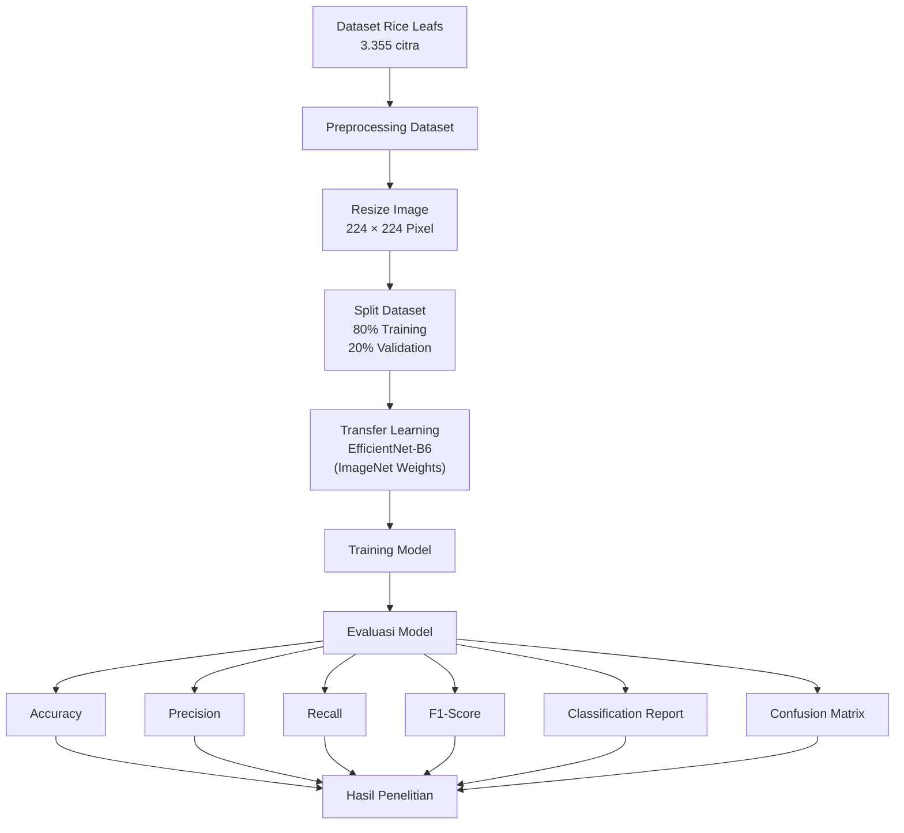
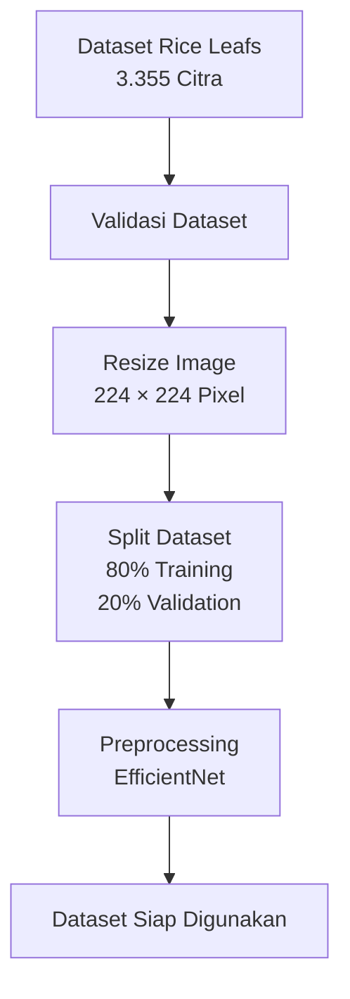
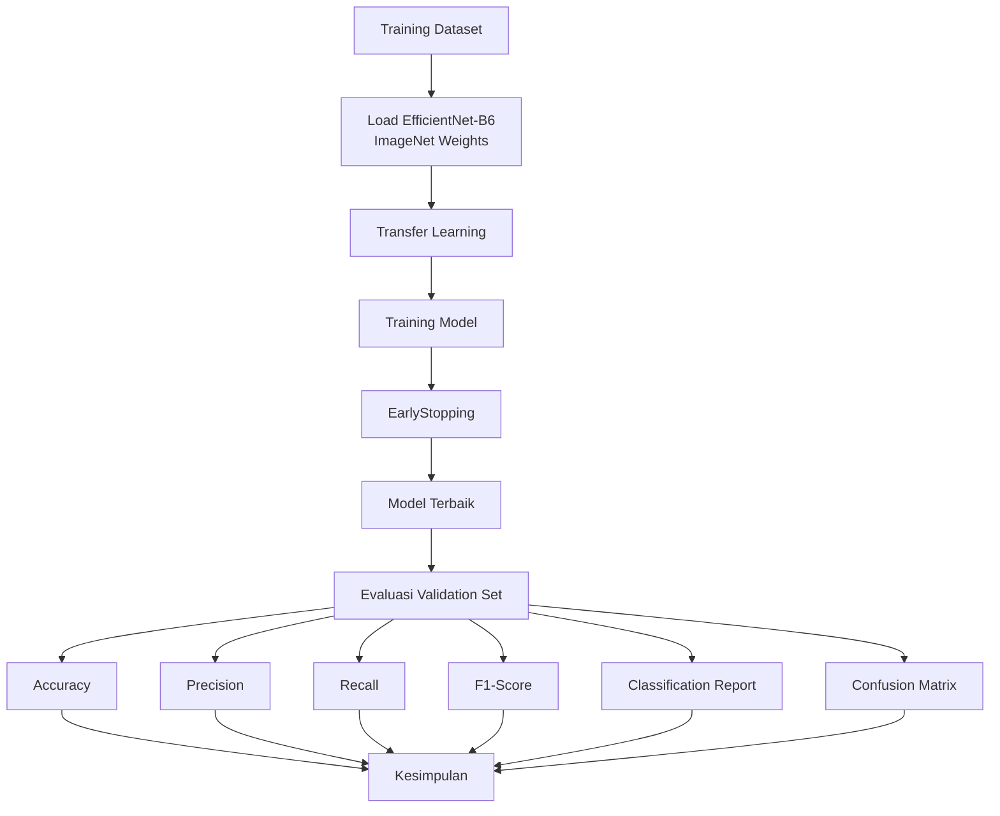
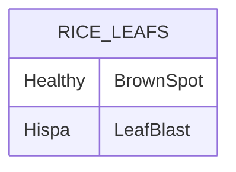

# Arsitektur, Desain, dan Landasan Teori

**Judul Penelitian:** Klasifikasi Penyakit Daun Padi Menggunakan EfficientNet-B6 dengan Pendekatan Transfer Learning

**Peneliti:** Syukron Nur Fadillah | NIM 240202885

**Status:** Selesai (Tahap Perancangan Metodologi, Implementasi Sistem, dan Evaluasi Model)

---

# 1. Arsitektur Komponen Sistem

Penelitian ini merupakan penelitian eksperimen berbasis klasifikasi citra menggunakan model **EfficientNet-B6** dengan pendekatan **Transfer Learning**. Seluruh proses dilakukan secara offline menggunakan dataset **Rice Leafs** pada lingkungan **Google Colab Free**. Dataset diproses melalui tahapan preprocessing, pelatihan model, evaluasi performa, hingga menghasilkan model klasifikasi penyakit daun padi.



---

# 2. Alur Preprocessing Data

Tahap preprocessing dilakukan sebelum proses pelatihan model. Seluruh citra diperiksa, diubah ukurannya menjadi **224 × 224 piksel**, kemudian dibagi menjadi **80% data training** dan **20% data validation**.



---

# 3. Alur Pelatihan dan Evaluasi Model

Model EfficientNet-B6 menggunakan bobot awal dari **ImageNet** kemudian dilakukan **Transfer Learning**. Setelah proses pelatihan selesai, model dievaluasi menggunakan beberapa metrik evaluasi.



---

# 4. Desain Variabel Penelitian

## 4.1 Variabel Independen (Independent Variable)

Variabel independen merupakan model deep learning yang digunakan pada penelitian.

| Variabel | Jenis | Keterangan |
|----------|------|------------|
| EfficientNet-B6 | Independent Variable | Model CNN berbasis Transfer Learning menggunakan bobot ImageNet |

---

## 4.2 Variabel Dependen (Dependent Variable)

Variabel dependen merupakan performa model klasifikasi.

| Variabel | Metrik |
|----------|---------|
| Accuracy | Persentase prediksi benar |
| Precision | Ketepatan prediksi |
| Recall | Kemampuan menemukan kelas sebenarnya |
| F1-Score | Harmonic Mean Precision dan Recall |
| Classification Report | Ringkasan seluruh metrik |
| Confusion Matrix | Distribusi hasil klasifikasi |

---

## 4.3 Variabel Kontrol

| Variabel | Nilai |
|----------|-------|
| Dataset | Rice Leafs |
| Jumlah Kelas | 4 |
| Split Dataset | 80% Training : 20% Validation |
| Ukuran Citra | 224 × 224 Pixel |
| Batch Size | 2 |
| Epoch Maksimum | 25 |
| Optimizer | Adam |

---

# 5. Struktur Dataset

Dataset yang digunakan merupakan **Rice Leafs Dataset** yang terdiri dari empat kelas.



| Kelas | Jumlah Citra |
|--------|-------------|
| Healthy | 1488 |
| BrownSpot | 523 |
| Hispa | 565 |
| LeafBlast | 779 |
| **Total** | **3355** |

---

# 6. Landasan Teori

## 6.1 Artificial Intelligence

Artificial Intelligence (AI) merupakan cabang ilmu komputer yang bertujuan mengembangkan sistem yang mampu meniru kemampuan berpikir manusia untuk menyelesaikan suatu permasalahan secara otomatis.

---

## 6.2 Machine Learning

Machine Learning merupakan bagian dari Artificial Intelligence yang memungkinkan komputer mempelajari pola dari data sehingga mampu melakukan prediksi tanpa diprogram secara eksplisit.

---

## 6.3 Deep Learning

Deep Learning merupakan pengembangan Machine Learning yang menggunakan jaringan saraf tiruan berlapis (Artificial Neural Network) sehingga mampu mempelajari fitur secara otomatis dari data citra.

---

## 6.4 Convolutional Neural Network (CNN)

CNN merupakan arsitektur Deep Learning yang dirancang khusus untuk pengolahan citra digital melalui proses convolution, pooling, dan fully connected layer.

---

## 6.5 EfficientNet-B6

EfficientNet-B6 merupakan salah satu varian EfficientNet yang menggunakan metode **Compound Scaling** sehingga mampu meningkatkan performa klasifikasi citra dengan penggunaan parameter yang lebih efisien dibanding arsitektur CNN konvensional.

---

## 6.6 Transfer Learning

Transfer Learning merupakan teknik pembelajaran yang memanfaatkan bobot model yang telah dilatih pada dataset ImageNet sehingga proses pelatihan menjadi lebih cepat serta mampu meningkatkan performa klasifikasi pada dataset baru.

---

# 7. Landasan Teori Evaluasi

Performa model dievaluasi menggunakan beberapa metrik berikut.

### Accuracy

```
Accuracy =
(TP + TN)
/ (TP + TN + FP + FN)
```

Accuracy menunjukkan persentase prediksi yang benar terhadap seluruh data.

---

### Precision

```
Precision =
TP / (TP + FP)
```

Precision menunjukkan tingkat ketepatan model dalam melakukan prediksi positif.

---

### Recall

```
Recall =
TP / (TP + FN)
```

Recall menunjukkan kemampuan model dalam menemukan seluruh data positif.

---

### F1-Score

```
F1 =
2 × Precision × Recall
------------------------
Precision + Recall
```

F1-Score digunakan untuk mengukur keseimbangan antara Precision dan Recall.

---

### Confusion Matrix

Confusion Matrix digunakan untuk melihat jumlah prediksi benar maupun salah pada setiap kelas klasifikasi.

---

### Classification Report

Classification Report menyajikan Accuracy, Precision, Recall, dan F1-Score setiap kelas sehingga performa model dapat dianalisis secara lebih rinci.

---

# 8. Keputusan Desain Penelitian

| Aspek | Keputusan | Justifikasi |
|-------|-----------|-------------|
| Dataset | Rice Leafs | Sesuai proposal penelitian |
| Model | EfficientNet-B6 | Menggunakan Transfer Learning |
| Split Data | 80% : 20% | Memisahkan data training dan validation |
| Image Size | 224 × 224 | Menyesuaikan input EfficientNet |
| Batch Size | 2 | Menyesuaikan keterbatasan Google Colab Free |
| Epoch | 25 | Sesuai rancangan penelitian |
| Optimizer | Adam | Stabil untuk proses training |
| EarlyStopping | Digunakan | Mengurangi risiko overfitting |

---

# 9. Mapping Implementasi Kode

| Komponen | Implementasi |
|----------|--------------|
| Dataset Loader | TensorFlow Dataset |
| Resize Image | tf.image.resize() |
| Split Dataset | 80% Training, 20% Validation |
| Model | EfficientNetB6 |
| Transfer Learning | weights="imagenet" |
| Optimizer | Adam |
| Loss Function | SparseCategoricalCrossentropy |
| Evaluasi | Accuracy, Precision, Recall, F1-Score, Classification Report, Confusion Matrix |
| Visualisasi | Matplotlib |

---

## Ringkasan

Penelitian ini menggunakan model **EfficientNet-B6** dengan pendekatan **Transfer Learning** untuk melakukan klasifikasi penyakit daun padi menggunakan dataset **Rice Leafs**. Seluruh implementasi dilakukan pada **Google Colab Free** dengan pembagian data **80% training** dan **20% validation**. Performa model dievaluasi menggunakan **Accuracy, Precision, Recall, F1-Score, Classification Report**, dan **Confusion Matrix** sehingga hasil penelitian dapat dianalisis secara komprehensif.
